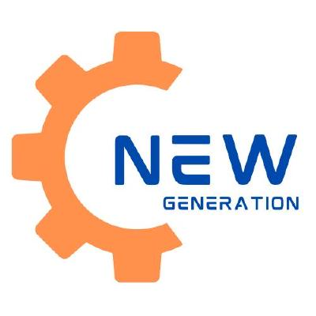

# API 6º Semestre BD

# PRO4TECH

<p align="center">
      
      <h2 align="center"> LuminIA </h2>
</p>

<p align="center">
  | <a href ="#desafio"> Desafio</a>  |
  <a href ="#solucao"> Solução</a>  |   
  <a href ="#backlog"> Backlog do Produto</a>  |
  <a href ="#dor">DoR</a>  |
  <a href ="#dod">DoD</a>  |
  <a href ="#sprint"> Cronograma de Sprints</a>  |
  <a href ="#tecnologias">Tecnologias</a> |
  <a href ="#manual">Manual de Instalação</a>  | 
  <a href ="#equipe"> Equipe</a> |
</p>

> Status do Projeto: Em desenvolvimento... 🚧 
>
> Relatório de Testes: Em desenvolvimento... 🚧 [PDF](docs/201302063.jpeg) 📊
>
> Pasta de Documentação: Em desenvolvimento... 🚧 [Link](docs/201302063.jpeg) 📄
> 
> Video do Projeto:  [Youtube](docs/201302063.jpeg) 📽️

## 🏅 Desafio <a id="desafio"></a>

Desafio em desenvolvimento... 🚧

## 🏅 Solução <a id="solucao"></a>

Solução em desenvolvimento... 🚧

---

## 📋 Backlog do Produto <a id="backlog"></a>

| Rank | Prioridade | User Story                                                                                                                                                                                                     | Story Points | Sprint | Requisito do Cliente | Status |
| :--: | :--------: | -------------------------------------------------------------------------------------------------------------------------------------------------------------------------------------------------------------- | :----------: | :----: | :------------------: | :----: |
|   1  |    Alta    | Preencher o readMe quando houver mais informações                                                                                            |      number      |    number   |          cod         |    🚧   |

---

## 🏃‍ DoR - Definition of Ready <a id="dor"></a>

* Lista de tópicos

## 🏆 DoD - Definition of Done <a id="dod"></a>

* Lista de tópicos

---

## 📅 Cronograma de Sprints <a id="sprint"></a>

| Sprint          |    Período    | Documentação                                     |
| --------------- | :-----------: | ------------------------------------------------ |
| 🔖 **SPRINT 1** | 08/09 - 28/09 | [Sprint 1 Docs](./docs/processo/sprints/sprint-1/README.md) |
| 🔖 **SPRINT 2** | 06/10 - 26/10 | [Sprint 2 Docs](./docs/processo/sprints/sprint-2/README.md) |
| 🔖 **SPRINT 3** | 03/11 - 23/11 | [Sprint 3 Docs](./docs/processo/sprints/sprint-3/README.md) |

## 💻 Tecnologias <a id="tecnologias"></a>

<h4 align="center">
 <a href="https://www.python.org/"></a>
 <a href="https://vuejs.org/"></a>
 <a href="https://www.mongodb.com/"></a>
 <a href="https://github.com/"></a>
 <a href="https://www.figma.com/"></a>
 <a href="https://pandas.pydata.org/"></a>
 <a href="https://fastapi.tiangolo.com/"></a>
 <a href="https://scikit-learn.org/"></a>
</h4>


## 📖 Manual de Instalação <a id="manual"></a>

### 🛠 Pré-requisitos

- Git ([Download](https://git-scm.com/downloads))

---

### 1. Clonar o Repositório Principal


> **Observação:** Se já tiver clonado sem os submódulos, execute:


---

### 2. Configuração do Backend

**1° **

**2° **

**3° **

**4° **

**Opção A: **

```bash

```

**Opção B: **

```bash

```

**Saída Esperada:**
<br>

---

### 3. Configuração do Frontend (auxia-frontend)

```bash

```

**Saída Esperada:**
<br>


## 🎓 Equipe <a id="equipe"></a>

<div align="center">
  <table>
    <tr>
      <th>Membro</th>
      <th>Função</th>
      <th>Github</th>
      <th>Linkedin</th>
    </tr>
    <tr>
      <td>Cauan Barbaglio</td>
      <td>Product Owner</td>
      <td><a href="https://github.com/Cauanvmb"></a></td>
      <td><a href="https://www.linkedin.com/in/cauan-barbaglio"></a></td>
    </tr>
    <tr>
      <td>Vinícius Chaves</td>
      <td>Scrum Master</td>
      <td><a href="https://github.com/ChavesVini"></a></td>
      <td><a href="https://www.linkedin.com/in/vin%C3%ADcius-chaves-197353244"></a></td>
    </tr>
    <tr>
      <td>Amanda Vannucci</td>
      <td>Desenvolvedor(a)</td>
      <td><a href="https://github.com/Amandavannuccic"></a></td>
      <td><a href="https://www.linkedin.com/in/amanda-vannucci"></a></td>
    </tr>
    <tr>
      <td>Guilherme Wunderlich</td>
      <td>Desenvolvedor(a)</td>
      <td><a href="https://github.com/wunderlich-15"></a></td>
      <td><a href="https://www.linkedin.com/in/guilherme-wunderlich-aa56a2228"></a></td>
    </tr>
    <tr>
      <td>Naiara Santos</td>
      <td>Desenvolvedor(a)</td>
      <td><a href="https://github.com/NaiaraSantos3"></a></td>
      <td><a href="https://www.linkedin.com/in/naiara-santos-73b83a186"></a></td>
    </tr>
    <tr>
      <td>Raul Neto</td>
      <td>Desenvolvedor(a)</td>
      <td><a href="https://github.com/raulnt"></a></td>
      <td><a href="https://www.linkedin.com/in/raul-neto-b51b24157/"></a></td>
    </tr>
  </table>
</div>
