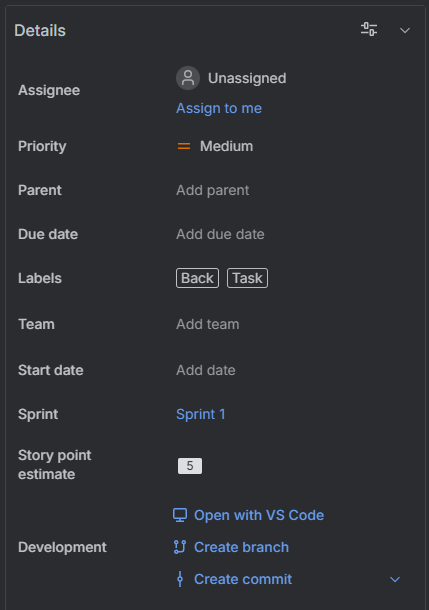
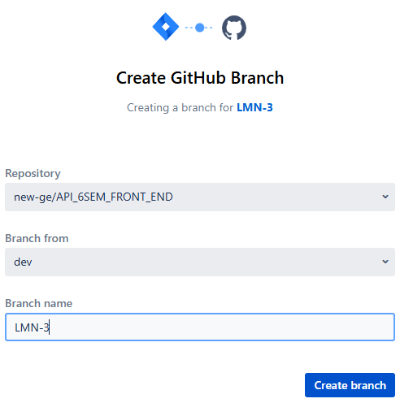

# Branch Standard
# Simplified Standard for Branch Names

Standardizing branch names is an important practice. In addition to helping with the understanding of the development flow, it also facilitates project organization and collaboration.

> Our branches are created from Jira, following the task code created by our Scrum Master.

##  Branch Format:
```<Branch_id>```

- `<Branch_id>`: Identifier of the task in the task management system: Jira

---
## Opening a Branch:
For Open a Branch follow some steps:

- In the Details window select "Create branch".

### Details window Example:



- In the "Create GitHub Branch" window select the right "Repository" **example**: new-ge/API_6SEM_FRONT_END.
- Delete the task description **example**: LMN-3 ~~- Treinamento-de-IA-para-gerar-respostas-dos-chamados~~.
- Click at "Create Branch".

### Create GitHub Branch window example


